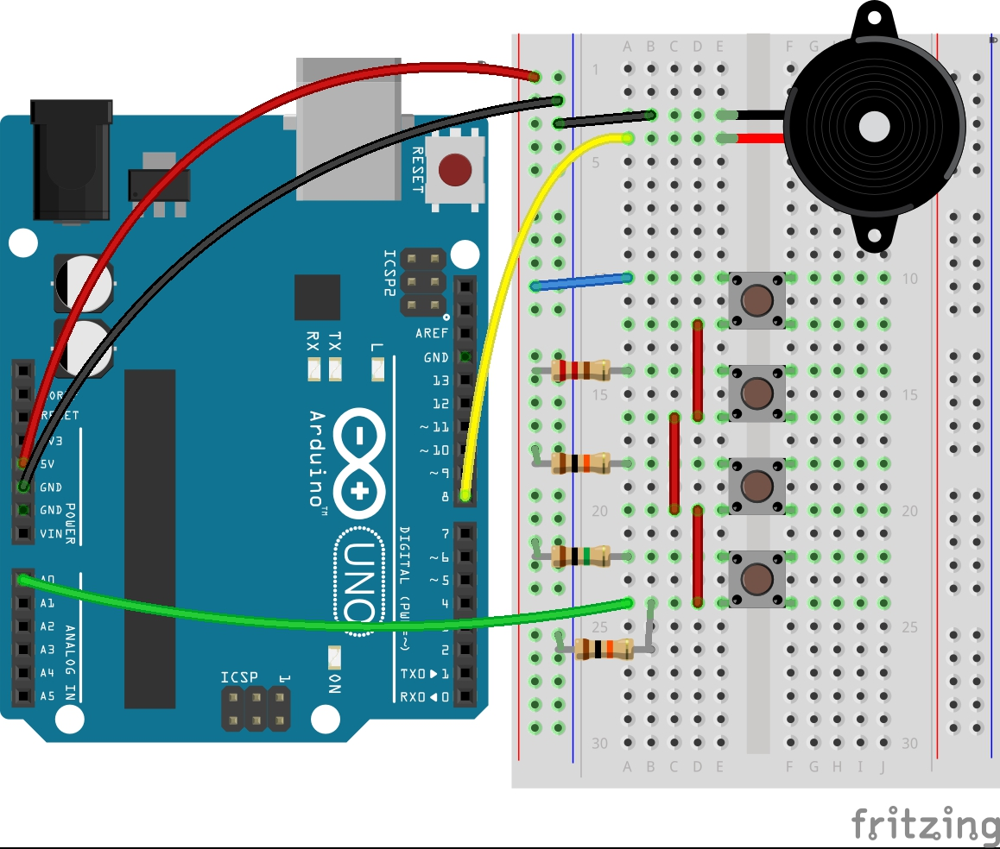

# Arduino Frequency Piano
  This arduino project is inspired by the "Arduino Projects Book" and is project 7. This project uses a single digital input to output multiple frequencies through a piezo. By using ressistors and buttons, we can control what frequncy will be outputed into the piezo. When completed, this project replicates a small piano with a single scale range of pitches. 
  
# Getting Started
  
  **Prerequisites**:
  
  **Hardware**
  - Arduino Uno
  - USB type B
  - Breadboard
  - Piezo
  - jumper wires
  - 4x tactical switch button
  - 10 Kilohm Resistor
  - 1 Megohm Resistor
  - 220 ohm Resistor
  
  **Resistor Chart for Reference**
  
 
   
  **Software**
  - [Arduino API Downloads](https://www.arduino.cc/en/main/software)
  - [Windows Installation Guide](https://www.arduino.cc/en/guide/windows)
  - [IOS Installation Guide](https://www.arduino.cc/en/guide/macOSX)

# Arduino Schematics

# Sources and References
 - [Arduino](https://www.arduino.cc/)
 - [Arduino Uno](https://store.arduino.cc/usa/arduino-starter-kit)
